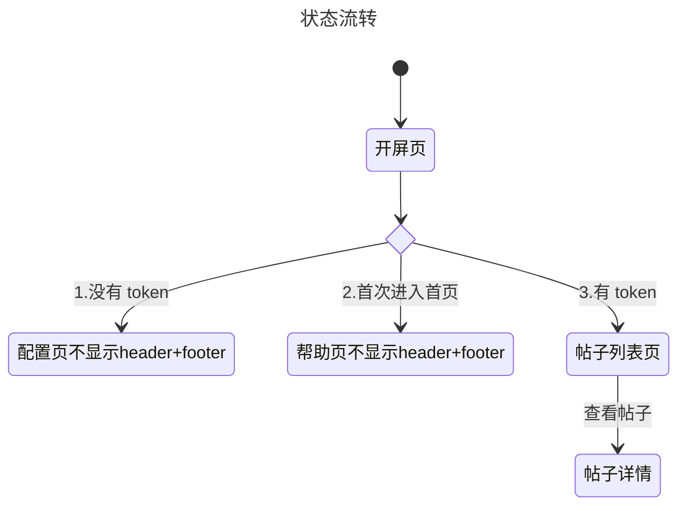

## go-v2ex

* 一个命令行版本的**v2ex**

## 状态流程图

```mermaid
---
title: 状态流转
---
stateDiagram-v2
    spalsh : 开屏页
    setting : 配置页不显示header+footer
    help : 帮助页不显示header+footer
    topics : 帖子列表页
    topics_show : 帖子详情
    state spalsh_state <<choice>>

    [*] --> spalsh

    spalsh --> spalsh_state
    spalsh_state --> setting: 1.没有 token
    spalsh_state --> topics : 3.有 token
    spalsh_state --> help : 2.首次进入首页
    topics --> topics_show : 查看帖子
```

## 预览图

## 安装使用 (TODO)

* `go install xxx`
* 去发布页面下载二进制文件

## 问题
* 文本不对齐
  * `export LC_CTYPE="en_US.UTF-8"`