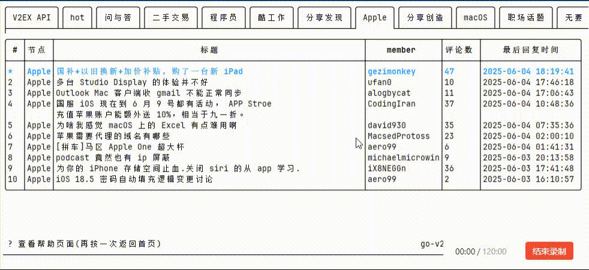
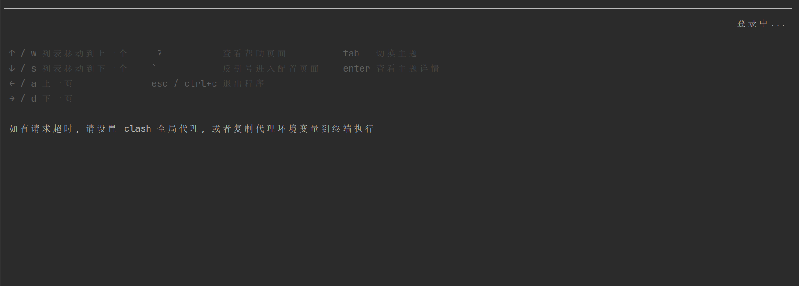
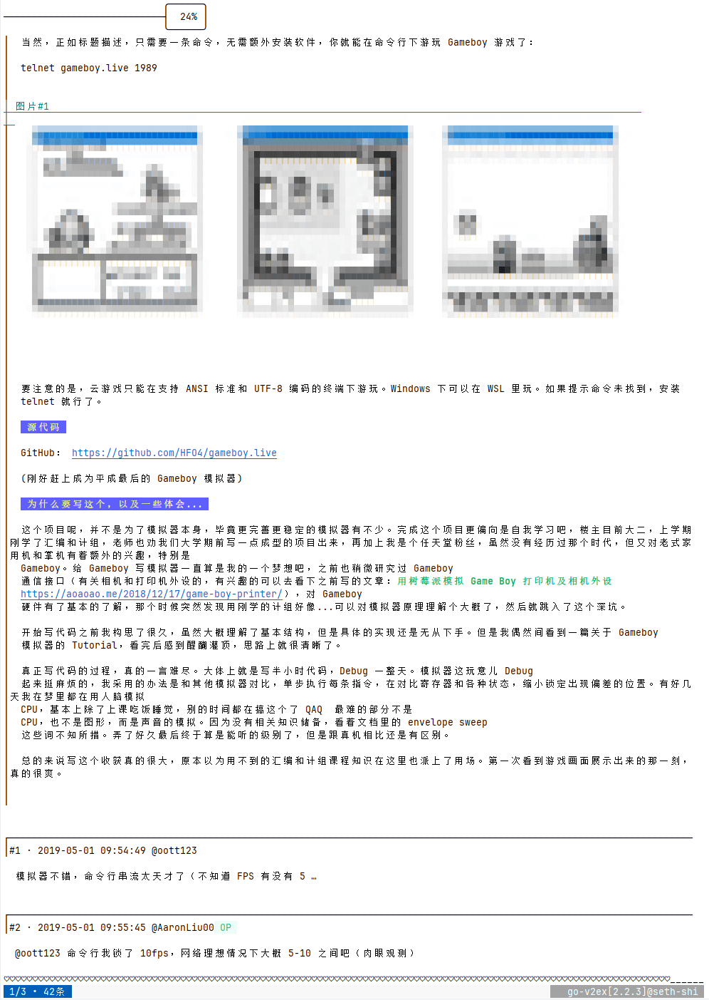

## go-v2ex
一个基于**Go** 语言 开发的命令行版 **V2EX** 客户端，支持在终端内快速浏览主题、查看评论、切换节点及基础配置管理，为极客用户提供高效的 **V2EX** 访问体验（摸鱼必备）。


## 安装使用

* 下载最新版本二进制文件

| 系统      | CPU 架构     | 下载链接                                                                                                                    |
|---------|------------|-------------------------------------------------------------------------------------------------------------------------|
| Mac     | amd64      | [go-v2ex-darwin-amd64.tar.gz](https://github.com/seth-shi/go-v2ex/releases/latest/download/go-v2ex-darwin-amd64.tar.gz) |
| Mac     | arm64      | [go-v2ex-darwin-arm64.tar.gz](https://github.com/seth-shi/go-v2ex/releases/latest/download/go-v2ex-darwin-arm64.tar.gz) |
| Linux   | amd64      | [go-v2ex-linux-amd64.tar.gz](https://github.com/seth-shi/go-v2ex/releases/latest/download/go-v2ex-linux-amd64.tar.gz)   |
| Linux   | arm64      | [go-v2ex-linux-arm64.tar.gz](https://github.com/seth-shi/go-v2ex/releases/latest/download/go-v2ex-linux-arm64.tar.gz)   |
| Windows | amd64      | [go-v2ex-windows-amd64.zip](https://github.com/seth-shi/go-v2ex/releases/latest/download/go-v2ex-windows-amd64.zip)     |
| Go      | 直装(免配环境变量) | `go install github.com/seth-shi/go-v2ex@latest`                                                                         |
* 解压压缩包中的二进制文件放到环境变量目录
* 运行 `go-v2ex` 命令即可启动程序。

## 功能特性
- **多节点切换**：支持自定义节点列表
- **主题浏览**：查看最新/热门主题，支持分页翻页
- **详情查看**：查看主题完整内容及评论列表（支持加载更多评论）
- **快捷操作**：通过快捷键快速切换页面、退出程序等
- **配置管理**：支持设置 API 令牌（用于部分高级功能）和自定义节点列表

## 预览图





## 帮助
### 设置默认终端代理
  * 确认已开启**Clash**等代理软件,
#### JetBrains
  * **设置** -> **工具** -> **终端** --> **项目设置:代环境变量**填入以下值
  * `http_proxy=http://127.0.0.1:7897;https_proxy=http://127.0.0.1:7897`
  * 随后打开一个新的终端窗口，开始享受~~~
#### vscode
* 打开设置, 搜索`terminal.integrated.env`
* 点击**在 settings.json 中编辑**, 增加以下配置
```json
{
  "terminal.integrated.env.linux": {
    "HTTP_PROXY": "http://127.0.0.1:7897",
    "HTTPS_PROXY": "http://127.0.0.1:7897"
  },
  "terminal.integrated.env.windows": {
    "HTTP_PROXY": "http://127.0.0.1:7897",
    "HTTPS_PROXY": "http://127.0.0.1:7897"
  }
}
```

## TODO 
- [ ] 终端显示图片

## 感谢
* [https://github.com/charmbracelet/bubbletea](https://github.com/charmbracelet/bubbletea)
* [https://github.com/charmbracelet/bubbles](https://github.com/charmbracelet/bubbles)
